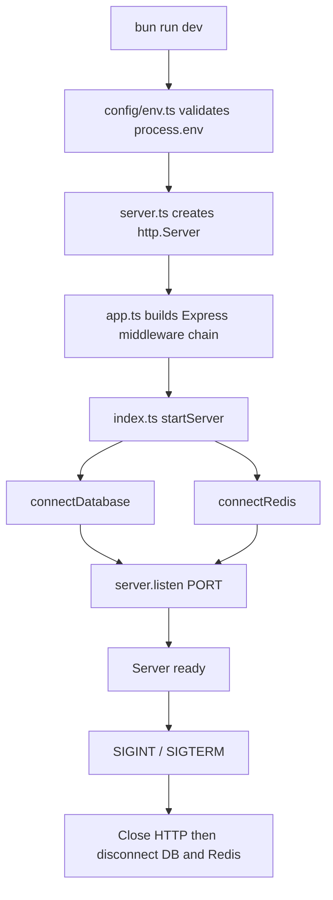
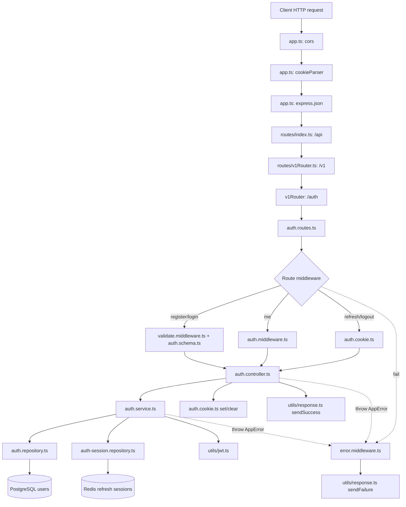
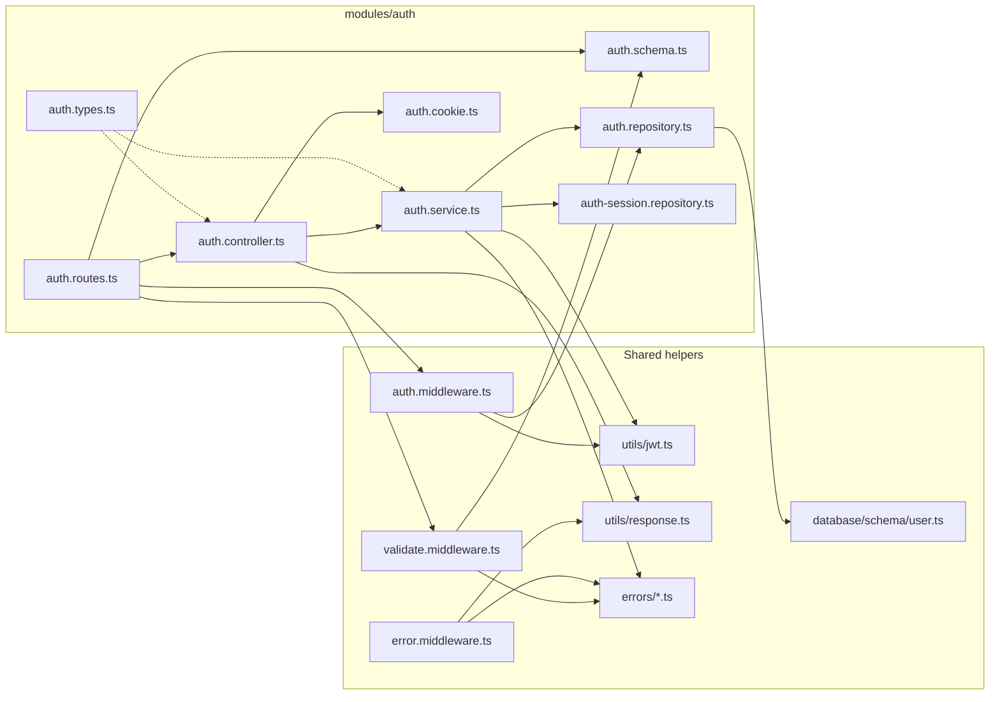
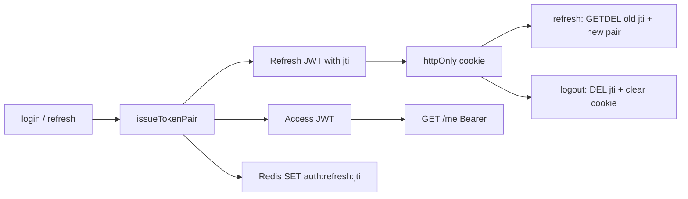
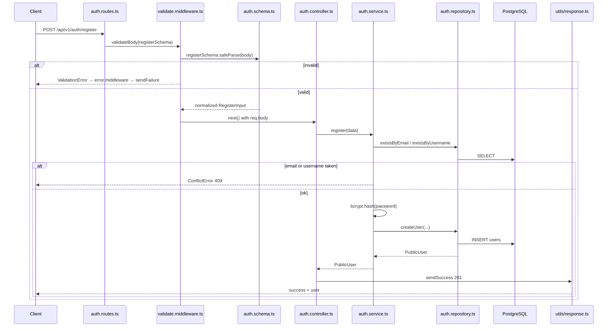
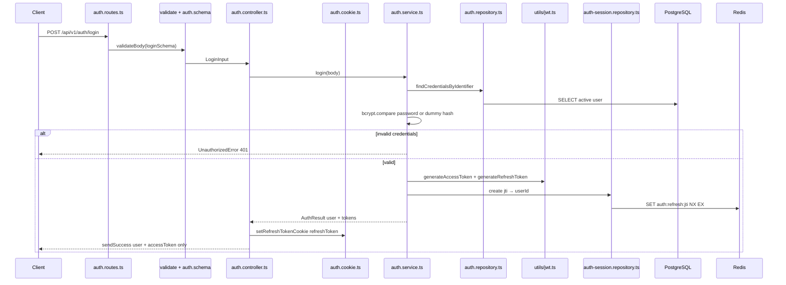
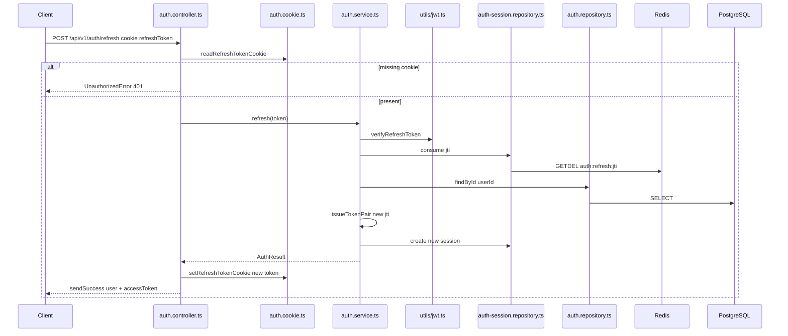
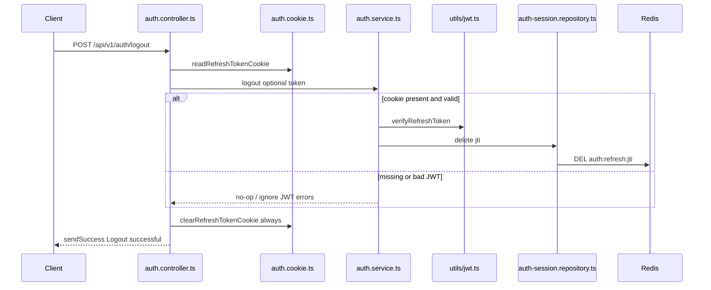
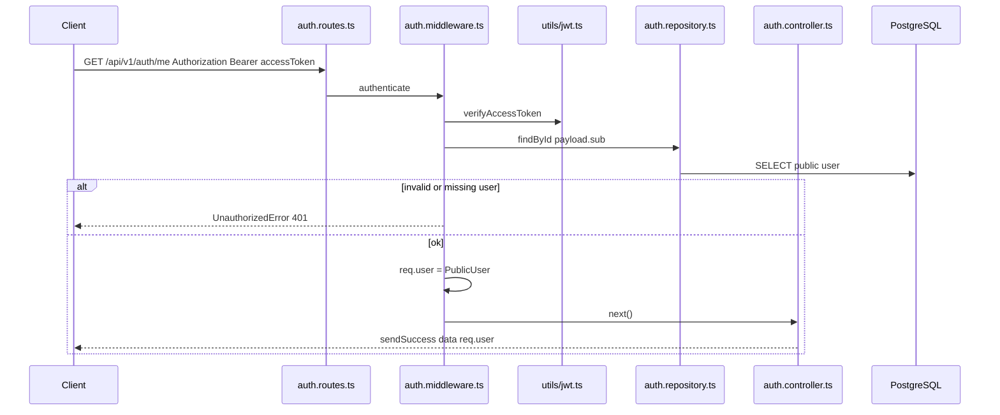

# Code Flow — Startup to Auth

Diagrams and short explanations of how code moves from server boot through each
auth endpoint.

---

## 1. Backend startup flow

When you run `bun run dev` in `apps/backend`, Bun starts at
[`index.ts`](apps/backend/src/index.ts).



**What this flow means**

1. [`env.ts`](apps/backend/src/config/env.ts) loads and validates config first. Bad secrets stop boot.
2. [`server.ts`](apps/backend/src/server.ts) wraps the Express app in an HTTP server.
3. [`app.ts`](apps/backend/src/app.ts) wires middleware and mounts `/api`.
4. [`index.ts`](apps/backend/src/index.ts) connects Postgres + Redis, then listens.
5. On shutdown, HTTP closes first, then DB and Redis disconnect.

Traffic is accepted only after dependencies are healthy.

---

## 2. Request path into the auth module

Every auth request follows this pipeline.



**What this flow means**

1. Global middleware in [`app.ts`](apps/backend/src/app.ts) runs first (CORS, cookies, JSON).
2. Routers mount the path: `/api` → `/v1` → `/auth`.
3. [`auth.routes.ts`](apps/backend/src/modules/auth/auth.routes.ts) picks middleware per endpoint.
4. Controller talks only to the service; service talks to repos / JWT helpers.
5. Success goes through `sendSuccess`. Failures fall through to `error.middleware.ts`.

```text
/api/v1/auth/register
/api/v1/auth/login
/api/v1/auth/refresh
/api/v1/auth/logout
/api/v1/auth/me
```

---

## 3. Auth file map (who calls whom)



**What each file does in the flow**

| File | Role |
| --- | --- |
| [`auth.routes.ts`](apps/backend/src/modules/auth/auth.routes.ts) | URL → middleware → controller |
| [`auth.schema.ts`](apps/backend/src/modules/auth/auth.schema.ts) | Zod body validation |
| [`auth.types.ts`](apps/backend/src/modules/auth/auth.types.ts) | `PublicUser`, `TokenPair`, `AuthResult` |
| [`auth.controller.ts`](apps/backend/src/modules/auth/auth.controller.ts) | HTTP in/out, cookies, `sendSuccess` |
| [`auth.service.ts`](apps/backend/src/modules/auth/auth.service.ts) | Business rules and token lifecycle |
| [`auth.repository.ts`](apps/backend/src/modules/auth/auth.repository.ts) | Postgres user reads/writes |
| [`auth-session.repository.ts`](apps/backend/src/modules/auth/auth-session.repository.ts) | Redis refresh sessions |
| [`auth.cookie.ts`](apps/backend/src/modules/auth/auth.cookie.ts) | Read / set / clear refresh cookie |
| [`validate.middleware.ts`](apps/backend/src/middleware/validate.middleware.ts) | Runs Zod, replaces `req.body` |
| [`auth.middleware.ts`](apps/backend/src/middleware/auth.middleware.ts) | Verifies Bearer access token → `req.user` |
| [`error.middleware.ts`](apps/backend/src/middleware/error.middleware.ts) | Thrown errors → failure JSON |
| [`utils/jwt.ts`](apps/backend/src/utils/jwt.ts) | Sign / verify JWTs |
| [`utils/response.ts`](apps/backend/src/utils/response.ts) | Success / failure envelopes |

---

## 4. Token flow (shared by login / refresh / logout / me)

```text
Access token  → short-lived Bearer header for protected routes
Refresh token → longer-lived httpOnly cookie at path /api/v1/auth
Redis jti     → proves the refresh token is still valid (one-time)
```



**What this flow means**

- Login/refresh create an access JWT (JSON) and a refresh JWT (cookie).
- Redis stores `auth:refresh:{jti} → userId` with TTL.
- Refresh consumes the old `jti` (`GETDEL`) and issues a new pair.
- Logout deletes the Redis key and clears the cookie.
- `/me` only needs a valid access token.

---

## 5. `POST /register` flow



**Flow explanation**

1. Route applies `validateBody(registerSchema)`.
2. Schema trims/lowercases email and username, checks password rules, rejects unknown fields.
3. Controller calls `authService.register(req.body)`.
4. Service checks uniqueness, hashes the password, creates the user.
5. Repository inserts into Postgres and returns a `PublicUser` (no password hash).
6. Controller responds `201` via `sendSuccess`.

---

## 6. `POST /login` flow



**Flow explanation**

1. Route validates `{ identifier, password }` with `loginSchema`.
2. Service loads credentials for an active, non-deleted user.
3. Password is compared with bcrypt (dummy hash if user missing, to reduce timing leaks).
4. On success, service issues access + refresh JWTs and stores the refresh `jti` in Redis.
5. Controller sets the refresh cookie and returns only `user` + `accessToken` in JSON.

---

## 7. `POST /refresh` flow



**Flow explanation**

1. Controller reads the refresh cookie (no body schema).
2. Service verifies the refresh JWT, then atomically consumes its Redis `jti`.
3. User is reloaded from Postgres; a new token pair is issued.
4. Controller replaces the cookie with the new refresh token and returns a new access token.

Old refresh tokens cannot be reused after a successful refresh.

---

## 8. `POST /logout` flow



**Flow explanation**

1. Controller reads the refresh cookie if present.
2. Service best-effort deletes the Redis session.
3. Cookie is always cleared in `finally`, even if the token was missing or invalid.
4. Client gets a success response either way.

---

## 9. `GET /me` flow



**Flow explanation**

1. Route runs `authenticate` before the controller.
2. Middleware extracts the Bearer access token and verifies it.
3. User is loaded from Postgres; attached as `req.user`.
4. Controller returns that public user via `sendSuccess`.
